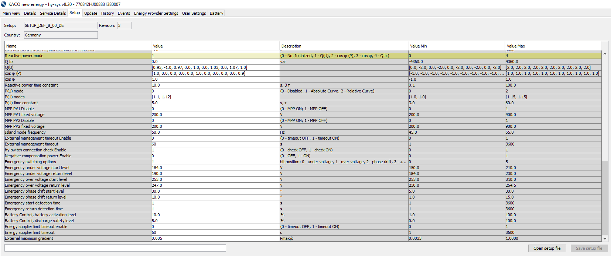

# Kaco Blueplanet Hybrid 10.0 TL3
The Kaco Blueplanet Hybrid 10.0 TL3 is a hybrid inverter with an AC power of 10 kW.  
The peak efficiency is >98.1 % and the european weighted efficiency for PV to AC is >97.8 %.  
The standby power consumption is <0.1 W and the idle consumption is <20 W.  
The inverter offers two PV inputs and a battery port for a high voltage battery.  
The CENTURIO 10 from the company Energy Depot seems to be the identical OEM product.  
The inverter also supports an island mode.  
The system can be controlled either by a power meter called Hy-switch, or by an external energy management system via the Ethernet network connection.  

## Control via Power Sensor - Kaco Hy-switch (Energy Depot VECTIS)
The Hy-switch can be connected in series with the main electrical connection using its internal current sensors, or it can be used with a simpler parallel connection of the three phases and external current sensors. In the first mode, the Hy-switch can disconnect the household from the grid in the event of a power outage and the inverter can change-over to emergency power supply mode.  
Connection with external current sensors has the advantage that the main power cable can be left untouched when island/emergency mode is not required.

The power meter uses a 230.4 kbit/s differential connection (RS-485) and communicates with the inverter every 10 ms (100 Hz).
This is a much higher update rate than other systems on the market, which typically use an RS-485 Modbus power/energy meter with a 9.6 kbit/s connection and an update rate of 1 to 4 Hz.

The control loop settling time of the system using the power meter is 200 ms, according to https://solar.htw-berlin.de/studien/stromspeicher-inspektion-2023.
This allows a fast reduction of grid consumption in case of load changes in the household.

Details in the [power_sensor directory](power_sensor).

## Control via External Energy Management System (EMS)
The external control interface via Ethernet/LAN port can be used with an energy management system.
Compatibility list without warranty:
1. Consolinno EMS
2. FEMS (only with inverter firmware version 7.x ! Caution: Downgrade from 8.x seems impossible). FEMS is based on OpenEMS.
3. OpenEMS with inverter firmware version 8.x if an identkey is available.

The only parameter that the EMS regularly writes to the inverter is the AC power setpoint. This causes the battery power to change as the PV input power changes. It has been observed with a custom OpenEMS controller module [shiftpvpeak](#custom-openems-module-shiftpvpeak), that the setpoint of AC power has a slow response time with the factory default inverter parameters. The OpenEMS controller should limit the AC feed-in and store additional PV energy in the battery (PV peak shaving). In some situations, the system has short periods of battery discharge because the setpoint is adjusted too slowly. In the graph ["PV_peakshift"](#PV_peakshift), a  battery discharge power of 225 W can be observed at 16:33. Values up to 1 kW with a 12 kWp PV-plant were observed.

### PV_peakshift


The possible reason could be:
1. Ramp limit in the inverter
2. Ramp limit or slow (PI-)controllers in OpenEMS, which uses 1sec cycle time per default.

In order to find the root cause of the slow control behaviour, a [command-line-tool](#control-via-command-line-tool) to set an AC power setpoint immediately was developed.


### Custom OpenEMS Module: shiftpvpeak
https://github.com/Philip-Kiehnle/openems/tree/feature/shiftpvpeak/io.openems.edge.controller.ess.shiftpvpeak

Motivation:  
With a 12 kWp PV plant and a 13.8 kWh battery, the 10 kW inverter should be able to use all the PV power.
Using the internal inverter control, there are several problems:
1. Per default, the inverter charges the battery immediately, when PV power is available. This may result in a full battery during phases of PV power larger than 10 kW and excess PV power can't be used.

2. When a SoC charge window is defined in the inverter config software Hy-Sys, e.g.  
10 a.m. : 10 % SoC  
3 p.m. : 90 % SoC  
, the inverter does not use the excess PV power, if the SoC would exceed the defined SoC ramp! This should be fixed in the inverter firmware!

3. The system is installed in a university without a power meter and the internal controller provides no function to discharge the battery in this scenario. The system should simply use all the PV power and discharge the excess PV power in the battery during a grid friendly timeslot. An online controller could use the energy price, but an offline control approach seems a good starting point and discharges the battery, when PV power decreases in the evening.   


Some notes on the system behaviour being controlled by shiftpvpeak module:

Kaco was set to minimal SoC = 5 % (Default).

Power consumption at night:

OpenEMS controller shiftpvpeak was set to discharge the battery to 5 %:  
16.08.2024 night begin SoC=5 %; During night, Pac = Pbat were in a range from -4 W to +10 W. Battery charged to 6 % in the morning with PV power.

OpenEMS controller shiftpvpeak was set to discharge the battery to 10 %:  
22.08.2024 night begin SoC=10 %; During night, Pac = Pbat were in a range from +18 W to +31 W. Battery discharged to 8 % during the night. There was no recharge in the early morning.  
02.11.2024 no charging for some days. Night begin SoC=5 %; Pac = Pbat were in a range from -5 W to +11 W. Battery charged to 6 % in the morning with PV power.

If a discharge limit in Hy-Sys software of 5 % is set, and the external EMS discharges to 2 %, the battery is charged afterwards with 125 W from the AC grid to 4 or 5 %. -> Set the limit above 5 % in the external EMS.  
Even with a discharge limit of 10 % in the EMS, an AC recharge may happen if the battery is not charged to high SoC for several days. Then the SoC estimate of the BYD BMS becomes inaccurate. It was observed, that the SoC drops fast from 10 % to 3 % even after discharge was stopped. The battery was then recharged to 5 % using 125 Watt from the AC grid for 2.5 hours during the night.  

Main findings:  
If the network cable has been disconnected, the inverter must be restarted before it will accept a connection.  
If the inverter has been restarted, OpenEMS may also need to be restarted.  
Efficiency is not taken into account in the Kaco/OpenEMS calculation, as Pac and Pbat are equal during night time.  
During winter, send the battery to sleep, as it can't do anything useful with this controller module.  
Use a controller with an energy tariff to be more grid-friendly.

## Control via command line tool

Requirements:
1. The identkey is necessary to send power commands via network.
2. Use Hy-Sys inverter config tool to set control to external EMS and enable battery (battery can be also enabled in the inverter menu).
3. The default user password has to be changed from default. "To be able to set Set-Points on KACO inverter starting from firmware version 8, it is required to change the user password to something different than 'user' via the KACO Hy-Sys tool."
4. PC with Ubuntu 22.04 was used. Other OS may also work 
5. Install Java or check java version:
```
javac -version
#javac 21.0.6

sudo apt install openjdk-21-jdk-headless
```

6. Optional: Extract libraries from a compiled OpenEMS.jar file
```
# Adjust path:
mkdir extracted_libs
cd extracted_libs
OPENEMS_JAR=../../openems/openems.jar
jar xf $OPENEMS_JAR jar/io.openems.edge.katek.edcom.jar jar/io.openems.common.jar
```

7. Compile Java code
```
EXT_LIB_PATH=extracted_libs/jar
EXT_LIB=$EXT_LIB_PATH/io.openems.edge.katek.edcom.jar:$EXT_LIB_PATH/io.openems.common.jar

javac -cp $EXT_LIB Inverter.java
```

8. Run Java code
```
java -cp .:$EXT_LIB Inverter <IP Address> <User Password> <IdentKeyHex> <p_ac_setpoint_W>
#example to set 100W feed-in to grid:
java -cp .:$EXT_LIB Inverter 192.168.100.115 pw123456 0x1122334455abcdef 100

#(Use ; instead of : for classpath on Windows.)
```

Useful tools:
```
# Check a jar package:
jar tf $
```

### Test of step response

In order to test the response time when used with an external energy management system, the following test setup was used:

1. Kaco Blueplanet Hybrid 10.0 TL3
Firmware Version:
COM 8_11
Controller 8_27
from package: 8.27.11.2.20_FIRMWARE_blueplanet_hybrid_10.0_TL3_and_CENTURIO.zip
2. BYD HVM 13.8kWh battery
3. Current sensor connected to oscilloscope
4. PC with the compiled Inverter Java file


pacSetPoint = 100  
In this case, 85 W came from the PV plant + 13 W from the battery = 98 W to grid  
Even without resend, this p_ac setpoint stays for tested 18 minutes. Reason: no external timeout was set in Hy-Sys software.

Ramp Test:  
From zero to 2 kW(feed-in) Kaco the inverter has a 40 sec ramp (50 W/sec).  
From 2 kW to -2 kW Kaco the inverter has a 80sec ramp (50 W/sec).  

In the OpenEMS code, there is a ramp limit of 500 W/sec for this inverter.  
src/io/openems/edge/kaco/blueplanet/hybrid10/ess/KacoBlueplanetHybrid10EssImpl.java:64:
```
private static final int MAX_POWER_RAMP = 500; // [W/sec]
```
But the inverter has an internal ramp of 50 W/sec per default. The difference will cause bad control behaviour, because the controllers don't get what they expect and the integral part of PI-controller winds up, causing overshoot.

### Fix of step response
With the Hy-Sys inverter configuration tool, login as manager user (password starts with %).

The setup tab looked like this, before the changes were applied:



Set "Energy management timeout Enable" to 1. This helps in case of external EMS hangup / broken network connection.  
Set "External maximum gradient" to 0.05. This equals to 500 W/sec.

In the German grid code VDE AR-N-4105 it says in chapter 5.7.4 "Wirkleistungsabgabe":  
Control by third parties:  
Setpoint change  
not faster than 0.66 % of Pmax per second and  
not slower than 0.33 % of Pmax per second.

The default setting of 0.5 % fulfills this requirement.
But the new value of 5 % (500 W/sec) should not cause trouble because:
1. This is a tiny plant in the electricity grid.
2. Changes in PV input power have much higher gradients.
3. The controller is more like an internal controller than a "third-party" setpoint.


# Ideas

## Hy-switch emulator
In Germany, every modern digital electricity meter has an optical interface, which provides the household power consumption with an update rate of e.g. 1 second after the meter is unlocked with a 4-digit key provided by the grid operator.
The optical interface sends Smart Message Language (SML) data using 9600 bps UART.
The message can be processed by a microcontroller and converted to the Hy-switch data format every 10 ms. It was shown in the git repository [PowerSensorEmulator](https://github.com/Philip-Kiehnle/PowerSensorEmulator), that the data of the grid operator's electricity meter can be used to imitate a vendor specific extra power sensor. But the fast update rate of the Hy-switch presents a new challenge. The microcontroller has to implement a dead-time compensation (DTC) such as a Smith predictor. This algorithm must be matched to the control loop response of the inverter to prevent instability. Simple example:
1. A toaster (1 kW load) is turned on at T0. The power at the point of common coupling (PCC) immediately jumps to 1 kW.
2. After about 1 sec, the digital electricity meter sends p=1kW via its optical interface for the next second.
3. The microcontroller in the PowerSensorEmulator sends a modified power value to the inverter.
4. The inverter adjusts its power according to its controller dynamics or ramp limit (50000 W/sec in this example)

| Timestamp  | Power at PCC | Electricity Meter | PowerSensorEmulator | Inverter Power |
| ---------- | ------------ | ----------------- | ------------------- | -------------- |
| T0 - 0.01s | 0 W          | 0 W               | 0 W                 | 0 W            |
| T0         | 1000 W       | 0 W               | 0 W                 | 0 W            |
| ...        | 1000 W       | 0 W               | 0 W                 | 0 W            |
| T0 + 1.00s | 1000 W       | 1000 W            | 1000 W              | 0 W            |
| T0 + 1.01s | 1000 W       | 1000 W            | 500 W               | 500 W          |
| T0 + 1.02s | 500 W        | 1000 W            | 0 W                 | 1000 W         |
| T0 + 1.03s | 0 W          | 1000 W            | 0 W                 | 1000 W         |
| ...        | 0 W          | 1000 W            | 0 W                 | 1000 W         |
| T0 + 2.00s | 0 W          | 0 W               | 0 W                 | 1000 W         |

Advantages:
- The PowerSensorEmulator avoids the installation of the large Hy-switch.
- No offset of the measured power and the power of the official electricity meter.

Drawbacks:
 - 1 second vs 10 ms "real" update rate. For the impact on system performance, see [PowerSensorEmulator](https://github.com/Philip-Kiehnle/PowerSensorEmulator).

Requirements:  
 - Hy-switch protocol reverse engineering

## Battery/inverter turnoff during night when empty
When controlled via external energy management, the inverter stays connected to the AC grid.
The inverter consumes approximately 20 W of AC power when the battery is empty due to semiconductor switching losses.
Even when the battery is empty, the inverter stays connected to the AC grid, e.g. a whole night wasting 10 hours × ~20 W = 0.2 kWh.

First test:  
Disable battery in inverter display (or Hy-Sys):  
Battery relay disconnected immediately (click). After about 30 minutes the main semi-automatic switch of the BYD HVM also disconnected, which prohibits automatic turnon.

Advantage:  
No inverter power consumption (no switching loss, no standby loss) and no Battery Management system (BMS) consumption.  
Drawback:  
PV power is required to start the system again. Write of the general battery register could cause wear-out of the EEPROM, if EEPROM is used. Battery needs manual restart because of the semi-automatic switch!

Second Approach: Find inverter turnoff command.  
Hint could be in ADspData.java:
{ "prime_sm.inverter_mode", "2", "5" }  // Does 2 mean read & write?

-> Stop the reverse engineering and focus my brainpower on developing an optimised [hybrid inverter](https://github.com/Philip-Kiehnle/PVBatteryInverter) using Gallium Nitride (GaN) semiconductors.
